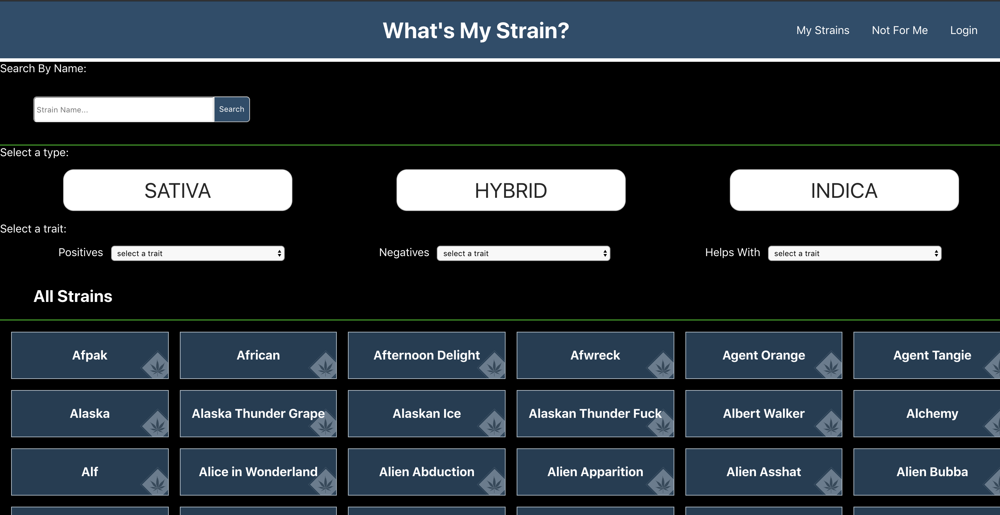
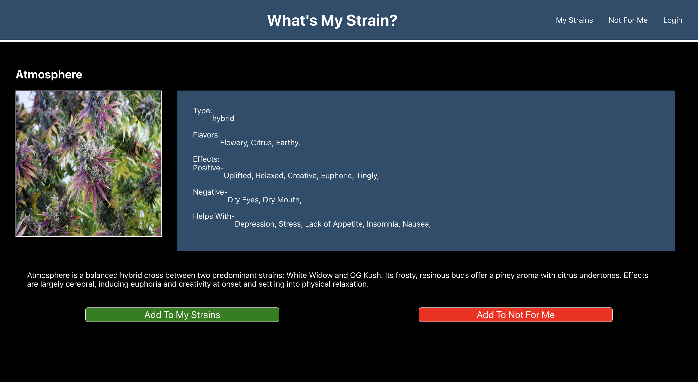

# What's My Strain?

Collaborators: [Tristan Holtz](https://github.com/Tristan-Holtz/)

### About What's My Strain?

What's My Strain is an app designed to help Medical Marijuana patients as well as cannabis enthusiasts that want to keep track of which strains they are able to use to their benefit and which strains they should avoid in the future. It uses an API to make fetch calls to a back end API and Redux featuring React components and front end testing using Jest and Enzyme, the project took about 5 days.

### Learning Goals

- Reinforce React fundamentals
- Reinforce using React Router to create a multi-page user experience
- Reinforce component and asynchronous JS testing
- Work with and navigate a shared, persistent API using GET, POST, and DELETE requests
- Implement Redux as the app’s place to store shared state
- Test Redux functions

### Production Link

### Setup

1. Fork or clone down this repo
1. In your terminal, run `npm i`
1. Run `npm start` and use your browser to navigate the app

### Stack/Technologies

- React
- Redux
- JavaScript / JSX
- Jest / Enzyme
- HTML / CSS

### Screenshots

Main page of the app

